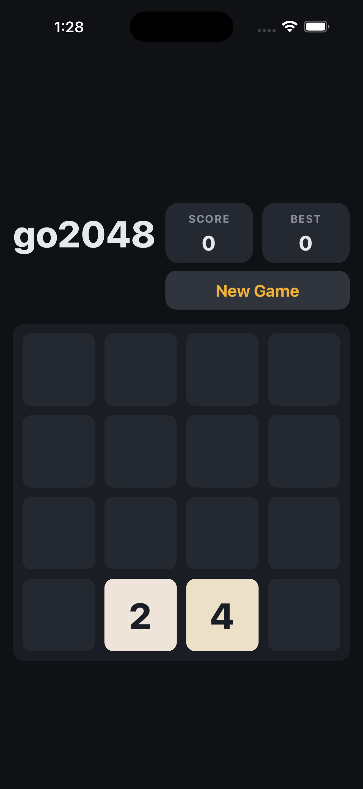

<h1 align="center">go2048</h1>

<p align="center">
  A fast, modern <b>2048</b> built as an H5 game with <b>PixiJS&nbsp;v7</b> —
  packaged for iOS &amp; Android with <b>Capacitor&nbsp;6 (Ionic)</b>.
</p>

<p align="center">
  <a href="https://fighttechvn.github.io/play2048/play/"><b>▶ Play in your browser</b></a>
  &nbsp;·&nbsp;
  <a href="https://fighttechvn.github.io/play2048/"><b>Website</b></a>
  &nbsp;·&nbsp;
  <a href="https://fighttechvn.github.io/play2048/download/"><b>Download</b></a>
</p>

<p align="center">
  
</p>

---

## 🎮 The game

Slide the tiles, merge matching numbers, and chase **2048** — then keep going for a
high score. Classic 2048 rules, rebuilt from scratch with smooth tile animations.

**How to play**

- **Desktop:** arrow keys or **WASD**.
- **Mobile / touch:** swipe up · down · left · right.
- Every move spawns a new tile. Two tiles with the same number merge into one worth
  double. Reach **2048** to win — the board keeps going so you can push for more.
- Your game and **best score** are saved automatically; close and come back any time.

## ✨ Features

- 🧊 **PixiJS v7** WebGL rendering — smooth 60 fps tile animations.
- 📱 **Responsive** portrait layout that fills any phone, tablet, or desktop window.
- 🌗 **Dark / Light / System** theme — follows the OS by default, toggle in-game, remembered.
- 🌍 **5 languages** — English, Tiếng Việt, 한국어, 中文, العربية — with full **RTL** layout for Arabic.
- 💾 **Auto-save** of the current game, best score, theme & language (`@capacitor/preferences`).
- 📳 **Haptics** on merges (native).
- 📦 One codebase → **Web, iOS 12+, and Android 5.1+** via Capacitor.

## 🛠️ Tech stack

| Layer | Tech |
|---|---|
| Game engine | [PixiJS v7](https://pixijs.com) — WebGL 1 (runs in older WebViews incl. iOS 12) |
| Language / bundler | TypeScript + [Vite](https://vite.dev) |
| Native packaging | [Capacitor 6](https://capacitorjs.com) (Ionic) — CocoaPods on iOS, Gradle on Android |
| Native plugins | `@capacitor/preferences`, `@capacitor/haptics`, `@capacitor/splash-screen`, `@capacitor/status-bar`, `@capacitor/app` |
| Min OS | **iOS 12.0** · **Android 5.1** (minSdk 22, targetSdk 35) |

---

## 🏗️ Architecture

The app is a **single TypeScript/PixiJS web build** (`dist/`) that runs three ways:
in a browser, and inside a Capacitor **WKWebView** (iOS) / **WebView** (Android).
There is no native game code — only the Capacitor bridge for storage, haptics, and
the splash screen.

### Layers

```
┌─────────────────────────────────────────────────────────────┐
│  Native shell (Capacitor 6)   iOS WKWebView · Android WebView │
│  plugins: preferences · haptics · splash-screen · status-bar  │
└───────────────────────────────▲───────────────────────────────┘
                                 │ JS bridge
┌───────────────────────────────┴───────────────────────────────┐
│  Rendering / controller (PixiJS v7 scene graph)                 │
│  main.ts → GameScene → TileView · Tweener · theme · i18n        │
└───────────────────────────────▲───────────────────────────────┘
                                 │ pure function calls
┌───────────────────────────────┴───────────────────────────────┐
│  Game logic (pure TypeScript, no PixiJS — unit-testable)        │
│  board.ts: grid · move/merge · spawn · win/over · serialize     │
└─────────────────────────────────────────────────────────────────┘
```

The **game logic is fully decoupled** from rendering: `board.ts` knows nothing
about PixiJS and returns plain data (which tiles moved, which merged, what spawned).
`GameScene` translates that data into animations. This keeps the rules testable and
the renderer swappable.

### Modules (`src/`)

| File | Responsibility |
|---|---|
| `main.ts` | Bootstrap — create the PixiJS `Application`, `GameScene`, `Tweener`; wire input; hide the native splash. |
| `game/board.ts` | **Pure 2048 engine** — 4×4 grid, `move(dir)` → movements/merges/spawn, win/over detection, `serialize()`/`load()`. No rendering. |
| `game/gameScene.ts` | **View + controller** — builds the scene graph (header, board, tiles, overlay), runs slide/pop animations, HUD, theme & language controls, persistence. |
| `game/tileView.ts` | One tile: a rounded-rect `Graphics` + centered `Text`, anchored at its center for scale-pop. |
| `game/theme.ts` | Dark / Light / System palettes. `COLORS` is a live binding reassigned by `setThemeMode()`; tile color ramp shared across themes. |
| `game/i18n.ts` | 5 locales, `t(key)`, `isRTL()` (Arabic). |
| `game/storage.ts` | Persistence via `@capacitor/preferences` — game state, best score, theme, locale (works on web + native). |
| `game/input.ts` | Keyboard (arrows / WASD) + touch swipe → a `Direction`. |
| `game/tween.ts` | Minimal tween engine driven by the PixiJS ticker (`deltaMS`). |

### Move/render data flow

```
input (swipe / key)
   → GameScene.handleMove(dir)
       → board.move(dir)         // pure: returns { movements, merges, spawn, over }
       → Tweener animates tiles to their new cells (slide), then pops merges/spawns
       → GameScene.refreshHud()  // score / best
       → storage.saveState()     // @capacitor/preferences
```

### iOS 12 support (notable)

Capacitor 6's iOS minimum is **13.0**, but go2048 ships **iOS 12.0**. Rather than
downgrade Capacitor (which would force Android below Play's required targetSdk 35),
the Capacitor 6 iOS sources are **patched** to guard every iOS-13-only API with an
iOS-12 fallback (`UIColor.systemBackground`, `WKWebpagePreferences`, `.darkContent`,
`FileHandle.seek/close`, `UIWindowScene`, CoreHaptics, …). Patches live in
[`patches/`](patches) and re-apply automatically after `npm install` via
[patch-package](https://github.com/ds300/patch-package) (`postinstall`). Android is
untouched — it stays on Capacitor 6 / targetSdk 35.

---

## 🚀 Run it locally

```bash
npm install      # also applies the iOS-12 patches (postinstall)
npm run dev      # http://localhost:5173

# or use the helper scripts:
./run.sh web      # dev server in the browser
./run.sh ios      # iOS Simulator
./run.sh android  # Android emulator/device
```

## 📦 Build artifacts

```bash
npm run build        # web → dist/
./build.sh android   # signed APK  → build-output/go2048-release.apk
./build.sh aab       # AAB         → build-output/go2048-release.aab
./build.sh ios       # signed IPA  → build-output/
```

## 📲 Release (two pipelines)

| Pipeline | Script | Target |
|---|---|---|
| **Internal** testers | `./scripts/firebase-distribute.sh [android\|ios]` | Firebase App Distribution |
| **Store** release | `./prod.sh [android\|ios]` | Play internal (AAB) · TestFlight (IPA) |

```bash
./prod.sh ios              # build signed IPA + upload to TestFlight
./prod.sh android          # build AAB + upload to Play internal
./prod.sh ios-listing      # upload App Store metadata + screenshots
./prod.sh android-listing  # upload Play listing metadata + images
```

`prod.sh` and `firebase-distribute.sh` auto-load credentials from
`.app_dist/.env.prod` and copy `.app_dist/fastlane/{android,ios}` into the native
projects if missing. See **Signing & secrets** below.

## 🌐 Deploy the web build (GitHub Pages)

```bash
./scripts/deploy-web.sh     # builds dist/ and publishes the landing + game to gh-pages
```

Live at **https://fighttechvn.github.io/play2048/** (game at `/play/`).

---

## 🔐 Signing & secrets (`.app_dist`)

All credentials and fastlane config live in a **separate private repo**,
`fighttechvn/play2048.app_dist`, checked out into `.app_dist/` (gitignored here):

```
.app_dist/
  .env.prod                 # all credentials, ${APP_DIST}-relative paths
  go2048-upload.jks         # Android upload/signing keystore
  key.properties            # Gradle signing config (read by android/app/build.gradle)
  playstore-service-account.json
  AuthKey_5F4KKWDHNV.p8     # App Store Connect API key
  go2048-dist.p12 · *.mobileprovision · AppleWWDRCAG3.cer
  fastlane/android/         # Appfile · Fastfile · metadata  → copied to android/fastlane
  fastlane/ios/             # Appfile · Fastfile · metadata · screenshots → ios/App/fastlane
```

`scripts/env.sh` resolves `$APP_DIST`, then `load_env` + `ensure_fastlane` make the
build self-contained. Full store-submission walkthrough: **[RELEASE.md](RELEASE.md)**.

## 📁 Project layout

```
src/                game logic + PixiJS rendering (TypeScript)
index.html          web entry
capacitor.config.ts unified appId vn.fighttech.go2048
android/  ios/       Capacitor 6 native projects (CocoaPods on iOS)
landing/            marketing site + privacy/terms/support (→ gh-pages root)
patches/            patch-package diffs (iOS-12 Capacitor guards)
assets/logo.svg     source art → app icons / splash
scripts/            env.sh · deploy-web.sh · firebase-distribute.sh
build.sh run.sh prod.sh
.app_dist/          PRIVATE: signing + fastlane (separate repo, gitignored)
```

## 📄 License

© FightTech. All rights reserved.

App IDs — iOS bundle &amp; Android applicationId: **`vn.fighttech.go2048`**.
